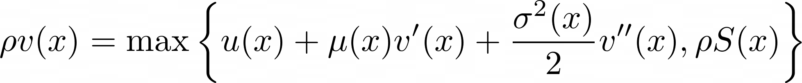

[](https://github.com/matthieugomez/EconPDEs.jl/actions)
[](http://codecov.io/github/matthieugomez/EconPDEs.jl/?branch=main)


This package provides the function `pdesolve` that solves (system of) nonlinear ODEs/PDEs arising in economic models (i.e. parabolic/elliptic PDEs arising from HJB equations). It is:

- robust: upwinding + fully implicit time stepping (see [here](https://github.com/matthieugomez/EconPDEs.jl/blob/master/examples/details.pdf))
- fast: sparse matrices + Newton acceleration
- simple-to-use

# A Simple Example

Let us solve the PDE for the price-dividend ratio in the Long Run Risk model with time-varying drift:
<!-- 
1 - \rho V + (1 - \frac{1}{\psi})(\mu - \frac{1}{2}\gamma \vartheta)V + \theta_\mu(\overline{\mu} - \mu) \partial_\mu V + \frac{1}{2}\frac{\frac{1}{\psi}-\gamma}{1-\frac{1}{\psi}}\nu_\mu^2 \vartheta \frac{(\partial_\mu V)^2}{V} + \frac{1}{2}\nu_\mu^2 \vartheta \partial_{\mu\mu}V  + \partial_t V  = 0
-->


```julia
using EconPDEs

# Define a discretized state space
# An OrderedDict in which each key corresponds to a state variable
# Grids can be non-homogeneous
stategrid = OrderedDict(:μ => range(-0.05, 0.1, length = 500))

# Define an initial guess for the value functions
# An OrderedDict in which each key corresponds to a value function to solve for, 
# specified as an array with as many dimensions as there are state variables
solend = OrderedDict(:V => ones(500))

# Define a function that encodes the PDE. 
# The function takes three arguments:
# 1. A named tuple giving the current value of the state. 
# 2. A named tuple giving the value function(s) (as well as its derivatives)
# at the current value of the state. 
# 3. (Optional) Current time t
# It must return a named tuple with the time derivatives
function f(state::NamedTuple, sol::NamedTuple)
           μbar = 0.018 ; ϑ = 0.00073 ; θμ = 0.252 ; νμ = 0.528 ; ρ = 0.025 ; ψ = 1.5 ; γ = 7.5
           μ = state.μ
           V, Vμ_up, Vμ_down, Vμμ = sol.V, sol.Vμ_up, sol.Vμ_down, sol.Vμμ
           # note that pdesolve will directly compute the derivatives of the valuefunction.
           # up and down correspond to the upward and downard derivative obtained by first difference
           Vμ = (μ <= μbar) ? Vμ_up : Vμ_down
           Vt = - (1  - ρ * V + (1 - 1 / ψ) * (μ - 0.5 * γ * ϑ) * V + θμ * (μbar - μ) * Vμ +
           0.5 * νμ^2 * ϑ * Vμμ  + 0.5 * (1 / ψ - γ) / (1- 1 / ψ) * νμ^2 *  ϑ * Vμ^2/V)
           (Vt = Vt,)
end

# The function `pdesolve` takes four arguments:
# 1. the function encoding the PDE
# 2. the discretized state space
# 3. the terminal value function
# 4. (Optional) a time grid
ys, residual_norms = pdesolve(f, stategrid, solend, range(0, 1000, length = 100))

# To solve directly for the stationary solution, 
# i.e. the solution of the PDE with ∂tV = 0,
# simply omit the time grid
y, residual_norm =  pdesolve(f, stategrid, solend)
```
More complicated ODEs / PDES (including PDE with two state variables or systems of multiple PDEs) can be found in the `examples` folder. 


# Boundary Conditions
When solving a PDE using a finite scheme approach, one needs to specify the value of the solution *outside* the grid ("ghost node") to construct the second derivative and, in some cases, the first derivative *at* the boundary. 

By default, the values at the ghost node is assumed to equal the value at the boundary node (reflecting boundaries). Specify different values for values at the ghost node using the option `bc` (see [BoltonChenWang.jl](https://github.com/matthieugomez/EconPDEs.jl/blob/master/examples/InvestmentProblem/BoltonChenWang.jl) for an example).

## EconPDEs v1.0.0
The 1.0 release has the following set of breaking changes:

1. The first argument of pdesolve (the function encoding the PDE) must accept directional first derivatives and it must return a named tuple of time derivatives
2. The fourth argument of pdesolve (the time grid) must be in increasing order
3. pdesolve now returns a type with fieldnames zero (for the solution) and residual_norm (for the norm of residuals)

See the updated examples for the new syntax.

## Optimal Stopping
Optimal stopping problems are also supported, as exemplified in [Leland.jl](examples/OptimalStoppingTime/Leland.jl). These problems are solved with "HJB variational inequality" (HJBVI), i.e.:



where `S(x)` is the value of exercising the option. Notice the traditional "value matching" (`S(x̲)=v(x̲)`) and "smooth pasting" (`S'(x̲)=v'(x̲)`) conditions are implied in the HJBVI formulation. See [the deck of notes from Ben Moll on stopping time problems](https://benjaminmoll.com/codes/) for more details. The `S(x)` can be provided to the solver as a vector defined on the grid via the keyword `y̲` (or `ȳ` as the upper bound for cost minimization problems).


# Examples
The [examples folder](https://github.com/matthieugomez/EconPDEs.jl/tree/master/examples)  solves a variety of models:
- *Habit Model*: Campbell Cochrane (1999) and Wachter (2005)
- *Long Run Risk Model*: Bansal Yaron (2004)
- *Disaster Model*: Wachter (2013)
- *Heterogeneous Agent Models*: He Krishnamurthy (2013), Brunnermeir Sannikov (2013), Garleanu Panageas (2015), Di Tella (2017), Haddad (JMP)
- *Consumption with Borrowing Constraint*: Wang Wang Yang (2016), Achdou Han Lasry Lions Moll (2018)
- *Investment with Borrowing Constraint*: Bolton Chen Wang (2009)

## Installation
The package is registered in the [`General`](https://github.com/JuliaRegistries/General) registry and so can be installed at the REPL with `] add EconPDEs`.

