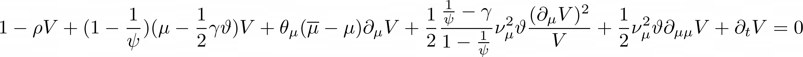

[](https://travis-ci.org/matthieugomez/EconPDEs.jl)


This package provides the function `pdesolve`that solves (system of) ODEs/PDEs arising in economic models. It provide a fast, robust and simple-to-use framework to solve PDEs. 

- The function is fast: the algorithm has a quadratic rate of convergence around the solution.
- It is robust: the underlying algorithm is based on a combination of upwinding and non-linear time stepping (more details [here](https://github.com/matthieugomez/EconPDEs.jl/blob/master/src/details.pdf))
- It is simple-to-use: the finite-difference scheme does not need to be explicitly coded. Specifying and solving a PDE can be done in less than 10 lines of codes.

The `examples` folder shows how to use the solver to solve a variety of macro - finance models:
- Asset Pricing Models
	- Habit Model (Campbell Cochrane (1999) and Wachter (2005))
	- Long Run Risk Model (Bansal Yaron (2004))
	- Disaster Model (Wachter (2013))
	- Heterogeneous Agent Models (Garleanu Panageas (2015), Di Tella (2017), Haddad (2015))
- Consumption with Borrowing Constraint
    - Wang Wang Yang (2016) Optimal consumption and savings with stochastic income and recursive utility
    - Achdou Han Lasry Lions Moll (2018) Optimal consumption and savings with stochastic income and One or Two assets
- Investment with Borrowing Constraint
	- Bolton Chen Wang (2009) Optimal liquidity management with cash constraints


# A Simple Example

For instance, to solve the PDE giving the price-dividend ratio in the Long Run Risk model:


```julia
using EconPDEs
# define state grid
state = OrderedDict(:μ => range(-0.05, stop = 0.1, length = 1000))

# define initial guess
y0 = OrderedDict(:V => ones(1000))

# define pde function that specifies PDE to solve. The function takes two arguments:
# 1. state variable `state`, a named tuple. 
# The state can be accessed with `state.x` where `x` denotes the name of the state variable.
# 2. current solution `sol`, a named tuple. 
# The current solution at the current state can be accessed with `sol.y` where `y` denotes the name of initial guess. 
# Its derivative can be accessed with `sol.yx` where `x` denotes the name of state variable.
# Its second derivative can be accessed with `sol.yxx`,
# It returns two outputs
# 1. a tuple with the value of PDE at current solution and current state 
# 2. a tuple with drift of state variable, used for upwinding 
function f(state, sol)
	μbar = 0.018 ; ϑ = 0.00073 ; θμ = 0.252 ; νμ = 0.528 ; ρ = 0.025 ; ψ = 1.5 ; γ = 7.5
	Vt = 1 / sol.V - ρ + (1 - 1 / ψ) * (state.μ - 0.5 * γ * ϑ) + θμ * (μbar - state.μ) * sol.Vμ / sol.V +
	0.5 * νμ^2 * ϑ * sol.Vμμ / sol.V + 0.5 * (1 / ψ - γ) / (1- 1 / ψ) * νμ^2 *  ϑ * sol.Vμ^2/sol.V^2
	(Vt,), (θμ * (μbar - state.μ),)
end

# the function `pdesolve` takes three arguments: (i) a function encoding the ode / pde (ii) a state grid corresponding to a discretized version of the state space (iii) an initial guess for the array(s) to solve for. 
pdesolve(f, state, y0)
```

More complicated ODEs / PDES (including PDE with two state variables or systems of multiple PDEs) can be found in the `examples` folder. 


# Boundary Conditions
When solving a PDE using a finite scheme approach, boundary conditions can be seen as ways to (i) construct the second derivative at the boundary (ii) construct the first derivative at the boundary if the drift of the state variable makes it go outside the boundary. By default, this package assumes that the boundary condition is that the derivative of the value function outside the boundary is zero. This default boundary condition cover three cases that cover most of macro - finance PDEs:

- In case the state variable is unbounded in the model, but must be bounded for the numerical solution, the right boundary condition is that first derivative is null at the border (i.e. reflecting boundaries). This is the default boundary condition. (see Habit, Long Run Risk, and Disaster models in the example folder).

- In case the volatility of the state variable is zero at the boundaries of the state space, the second derivative does not appear in the PDE at the boundary so there is no need for supplementary conditions. This typically happens in heterogeneous agent models where the state variable is bounded 0 and 1. (see GarleanuPanageas and DiTella models in the example folder).

- In case the boundary of the state variable is due to financial frictions (for instance borrowing constraint), the right boundary condition is that the value of the first derivative at the border makes the agent want to stay on the grid. This means that, when writing the PDE, one must hardcode the value of the first derivative at the boundary in case the drift of the state variable makes it go outside the boundary. One may also need to input the second derivative at the upper boundary of wealth (see WangWangYang model or AchdouHanLasryLionsMoll in the example folder)

In some rare cases,  the boundary condition does not fall into one of these three cases. When this happens, one can specify particular values for the derivative at the boundaries using the `bc` option (see BoltonChenWang model in the example folder).

# Installation

To install the package
```julia
using Pkg
Pkg.add("EconPDEs")
```

