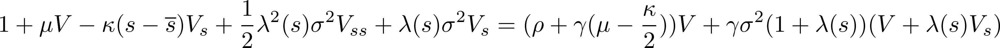
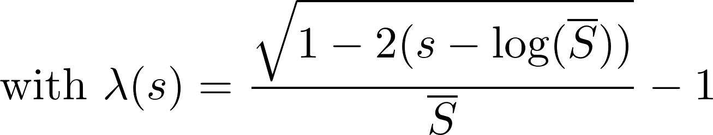

[](https://travis-ci.org/matthieugomez/EconPDEs.jl)

# Install
```julia
Pkg.clone("https://github.com/matthieugomez/EconPDEs.jl")
```

This package proposes a new, fast, and robust algorithm to solve PDEs that arise in economic models (i.e. non linear elliptic PDEs, such as  Hamilton-Jacobi-Bellman equations). These PDEs have a particular structure and they should be solved with a particular algorithm. I discuss in details this algorithm [here](https://github.com/matthieugomez/EconPDEs.jl/blob/master/src/details.pdf). It is based on finite difference schemes, upwinding, and non linear time steps. 

This solver is much more robust for economics PDEs than the solver in [DifferentialEquations.jl](https://github.com/JuliaDiffEq/DifferentialEquations.jl), a general PDE solver available in Julia.

# Solving  PDEs
The function `pdesolve` takes three arguments: (i) a function encoding the pde (ii) a state grid corresponding to a discretized version of the state space (iii) an initial guess for the array(s) to solve for. 

For instance, to solve the PDE corresponding to the Campbell Cochrane model:



```julia
Pkg.clone("https://github.com/matthieugomez/EconPDEs.jl")
using EconPDEs
# define state grid
state = OrderedDict(:s => linspace(-100, -2.4, 1000))

# define initial guess
y0 = OrderedDict(:V => ones(1000))

# define pde function that specifies PDE to solve. The function takes two arguments:
# 1. state variable 
# 2. current solution y
# It returns a tuple composed of
# 1. Value of PDE at current solution and current state (note that the current solution and its derivatives can be accessed as fields of y)
# 2. drift of state variable (used for upwinding)
function f(state, y)
	μ = 0.0189 ; σ = 0.015 ; γ = 2.0 ; ρ = 0.116 ; κ = 0.13 ; Sbar = 0.5883
	λs = 1 / Sbar * sqrt(1 - 2 * (state.s - log(Sbar))) - 1
	out = 1 + μ * y.V  - κ * (state.s - log(Sbar)) * y.Vs  + 1 / 2 * λs^2 * σ^2 * y.Vss + λs * σ^2 * y.Vs - (ρ + γ * μ - γ * κ / 2) * y.V - γ * σ^2 * (1 + λs) * (y.V + λs * y.Vs) 
	return out, - κ * (state.s - log(Sbar))
end

# solve PDE
pdesolve(f, state, y0)
```

More complicated PDES (includining PDE with two state variables or systems of multiple PDEs) can be found in the `examples` folder. 

The `examples` folder contains code to solve
- Campbell Cochrane (1999) and Wachter (2005) Habit Model
- Bansal Yaron (2004) Long Run Risk Model
- Garleanu Panageas (2015) Heterogeneous Agent Models
- Wang Wang Yang (2016) Portfolio Problem with Labor Income
- Di Tella (2017) Model of Balance Sheet Recessions


# Solving Non Linear Systems
`pdesolve` internally calls `finiteschemesolve` that is written specifically to solve non linear systems associated with finite difference schemes. `finiteschemesolve` can also be called directly.

Denote `F` the finite difference scheme corresponding to a PDE. The goal is to find `y` such that `F(y) = 0`.  The function `finiteschemesolve` has the following syntax:

 - The first argument is a function `F!(y, out)` which transforms `out = F(y)` in place.
 - The second argument is an array of arbitrary dimension for the initial guess for `y`
 - The option `is_algebraic` (defaults to an array of `false`) is an array indicating the eventual algebraic equations (typically market clearing conditions).

 Some options control the algorithm:
 - The option `Δ` (default to 1.0) specifies the initial time step. 
 - The option `inner_iterations` (default to `10`) specifies the number of inner Newton-Raphson iterations. 
 - The option `autodiff` (default to `true`) specifies that the Jacobian is evaluated using automatic differentiation.


